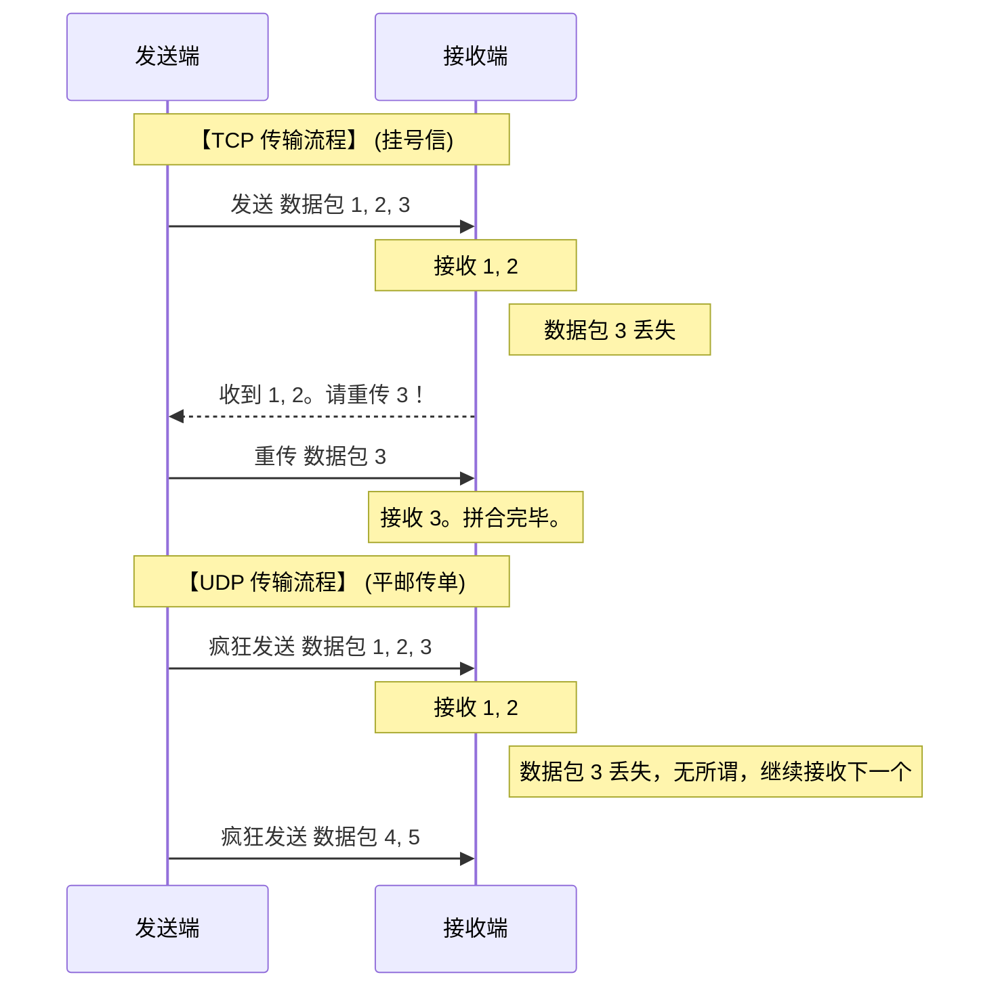

在探讨[代理如何接管游戏](/blog/gaming-proxy-tun-udp)等进阶话题时，我们不可避免地会遇到两个英文缩写：**TCP** 和 **UDP**。

它们是现代互联网中最基础的两个底层传输协议。无论是聊天、看视频还是打游戏，您的数据最终都会被打包成这两种格式之一发送出去。了解它们的区别，对网络排错具有决定性的帮助。

## TCP 与 UDP 的本质区别

我们可以用一个形象的比喻来区分它们：

**TCP (传输控制协议) —— “挂号信”**
TCP 是一种**可靠的、面向连接**的协议。在发送数据前，双方必须先“握手”建立连接。发送过程中，如果某个数据包丢失，接收方会要求重新发送，直到所有包裹完好无损、按顺序抵达。
*   **特点**：极度稳定、保证顺序、但速度稍慢。
*   **常见应用场景**：网页浏览 (HTTP/HTTPS)、文件下载、收发邮件。因为哪怕少了一个字节，网页也可能乱码。

**UDP (用户数据报协议) —— “平邮传单”**
UDP 是一种**不可靠的、无连接**的协议。发送方只管把数据包疯狂扔出去，不握手、不确认对方是否收到、也不管顺序。
*   **特点**：极度快速、延迟极低、但容易丢失。
*   **常见应用场景**：网络竞技游戏（王者荣耀、FPS射击）、视频通话/会议。在这些场景中，如果丢失了前一秒的人物位置数据，重新补发已经没有意义了，直接接收最新的位置数据即可。

## 数据包收发逻辑对比图解

## 这对代理客户端有什么影响？

传统的代理环境，往往对这两种协议呈现出截然不同的态度：

1.  **TCP 是“一等公民”**：系统自带的代理设置（System Proxy）和最初代的代理协议，几乎都是专为接管 TCP 流量设计的。因为这满足了 90% 用户“看看外网”的需求。
2.  **UDP 是“困难户”**：要代理 UDP，不仅需要客户端支持（如开启 [TUN 模式](/blog/what-is-tun-mode)），还需要目标节点服务商的底层防火墙予以放行。由于 UDP 无连接的特性，它极易被黑客用来进行 DDoS 放大攻击或进行无休止的 BT 下载，因此很多服务商会在服务端直接屏蔽所有的 UDP 请求。

这就是为什么您经常会发现：开了代理后看 YouTube（基于 TCP 或 QUIC 降级）丝滑无比，但一打开国外的游戏（基于 UDP）却死活连不上服务器的原因。

## 版本说明

本文根据当前可确认的技术原理与常规排错逻辑编写。由于不同系统环境、客户端版本及网络提供商的策略差异，具体表现可能存在不同，请以您的实际设备状态为准。
