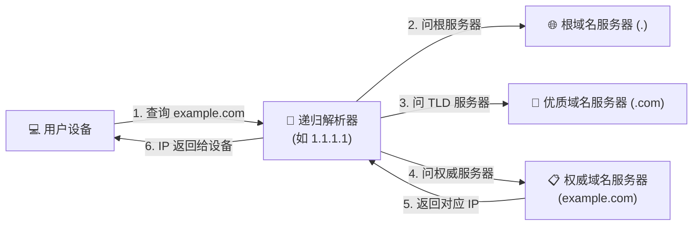

互联网上的计算机在互相通信时，只认由数字组成的 IP 地址，而人类习惯记忆的是字母域名。**DNS（域名系统）** 扮演的就是整个互联网的「电话簿」，在毫秒之间把我们输入的域名精准翻译成服务器对应的 IP 地址。

但在移动通信网络底层，基站和交换机根本不认识“张三”是谁，它们只认识纯数字的电话号码。正是手机里的**“通讯录”**，在人名与电话号码之间建立了一一对应的索引。

在庞大的互联网世界中，也有一本规模最大、永不停歇的“超级通讯录”，这就是 **DNS（Domain Name System，域名系统）**。

无论是我们每天在浏览器输入的 `google.com`、`apple.com`，还是在手机 App 中刷短视频、聊天，背后每一次网络交互的第一步，都离不开 DNS 的默默指引。

今天就来用最通俗易懂的语言，为你彻底揭开 DNS 的神秘面纱。

---

## 基本概念：DNS 是什么？

### 1. 人类语言 vs 计算机语言
计算机网络之间的相互通信，依靠的是 **IP 地址（IP Address）**。
- 在 IPv4 环境下，它是一串四段式的数字（例如：`142.250.190.46`）；
- 在 IPv6 环境下，它是一长串十六进制字符（例如：`2404:6800:4008:803::200e`）。

对于人类来说，记住几万个网站的冰冷数字 IP 是不可能完成的任务。人类更擅长记忆具有语义特征的**域名（Domain Name）**，比如 `baidu.com` 或 `github.com`。

为了解决“人类好记忆的域名”与“机器好识别的 IP 地址”之间的转换矛盾，DNS 应运而生。

> **DNS 的核心定义**：
> DNS（Domain Name System，域名系统）是互联网的一项核心基础设施服务。它充当互联网的“全球电话簿”，负责将人类可读的网站域名（如 `www.cloudflare.com`）翻译成计算机互相连接所需的数字 IP 地址（如 `104.16.124.96`）。

### 2. 域名的层级结构
域名并不是随心所欲拼凑出来的，它的结构如同一个倒挂的树状目录体系，从右往左层级依次降低：

```
www.example.com.
 │     │      │   └── 根域 (Root Domain, 末尾隐含的点 ".")
 │     │      └────── 优质域名 (TLD, 如 .com, .org, .cn)
 │     └───────────── 二级域名 (Second-Level Domain, 如 example)
 └─────────────────── 主机名 / 子域名 (Subdomain, 如 www, blog, mail)
```

- **根域（Root Domain）**：位于最顶端，通常表示为一个句点 `.`（日常输入网址时通常自动省略）。
- **优质域名（TLD - Top-Level Domain）**：如通用优质域 `.com`、`.net`、`.org`，以及国家/地区优质域 `.cn`、`.jp`、`.uk`。
- **二级域名（Second-Level Domain）**：企业或个人向域名注册商购买的名字，如 `google`、`apple`。
- **子域名（Subdomain / Hostname）**：域名所有者自主设立的前缀，如 `www`（主站）、`api`（接口）、`mail`（邮箱）。

---

## 进一步理解：DNS 是如何组织与工作的？

互联网上有数十亿台联网设备和数以亿计的域名，如果只用一台超级中心服务器来存储所有域名记录，一旦这台服务器宕机，全球互联网将瞬间瘫痪。

因此，DNS 从设计之初就被构建为一个**去中心化、分层分布式**的庞大数据库系统。

### 1. DNS 系统的核心角色
在 DNS 的体系中，主要有四类服务器协同工作：

1. **DNS 递归解析器（Recursive Resolver）**：就像为你跑腿的“专属办事员”。当你向它发出查询请求时，它会代替你在全球 DNS 网络中逐级打听，直到查出结果并交还给你。我们平时在电脑或路由器上配置的 `8.8.8.8` 或 `1.1.1.1`，就是递归解析器。
2. **根域名服务器（Root Nameserver）**：全球一共有 13 组根域名服务器逻辑标识（通过 Anycast 技术分布在全球数百个物理站点）。它不存具体 IP，但它清楚知道所有的优质域名（如 `.com`）该去哪里找。
3. **优质域名服务器（TLD Nameserver）**：管理特定后缀的所有记录，比如负责告诉查询者 `.com` 旗下的 `example.com` 应该去哪个权威服务器查询。
4. **权威域名服务器（Authoritative Nameserver）**：域名的“最终户口本持有者”。它是域名拥有者真正配置解析记录的地方，拥有最终的话语权。

想要深入了解这四类服务器如何一步步接力查询，可以参阅我们的下一篇专题指南：[什么是 DNS 解析？](/blog/tools-27/)。也可以参考 [Cloudflare DNS 官方文档与指南](https://developers.cloudflare.com/dns/) 学习权威架构。



### 2. 常见的 DNS 记录类型
当网站管理员在权威服务器上配置 DNS 时，经常会遇到以下几种常见记录：

| 记录类型 | 全称 | 作用说明 | 常见示例 |
| :--- | :--- | :--- | :--- |
| **A 记录** | Address | 将域名指向一个 **IPv4 地址** | `example.com -> 93.184.216.34` |
| **AAAA 记录** | Quad-A | 将域名指向一个 **IPv6 地址** | `example.com -> 2606:2800:220:1:248:1893:25c8:1946` |
| **CNAME 记录** | Canonical Name | 别名记录，将一个域名指向另一个域名 | `www.example.com -> example.com` |
| **MX 记录** | Mail Exchanger | 指定负责接收该域名电子邮件的邮件服务器 | `example.com -> mail.protection.outlook.com` |
| **TXT 记录** | Text | 存储纯文本信息，常用于域名所有权验证、SPF 反垃圾邮件认证 | `v=spf1 include:_spf.google.com ~all` |
| **NS 记录** | Name Server | 指定由哪台权威服务器负责解析该域名 | `ns1.cloudflare.com` |

### 3. DNS 缓存（Cache）与 TTL
如果每次访问网页都要去全球服务器打听一圈，网络开销将非常巨大。为此，DNS 引入了强大的**多级缓存机制**。

你的操作系统、本地路由器、以及递归解析器都会将查到的结果缓存一段时间。

每个 DNS 记录都带有一个 **TTL（Time to Live，生存时间）** 属性，单位为秒：
- 如果 TTL 设置为 `300`，意味着各级服务器在缓存该结果 5 分钟后必须清除，下次查询需要重新请求最新的记录；
- 如果 TTL 设置为 `86400`（1 天），则能大幅减轻查询负载，但在修改服务器 IP 时，全球生效需要等待更长时间。

---

## 实际应用：DNS 如何影响我们的日常上网？

DNS 不仅仅是默默无闻的幕后功臣，在日常网络使用与代理优化中，它直接决定了你的网络体验质量与安全性。

### 1. 为什么推荐更换公共 DNS？
在默认情况下，你的电脑和手机使用的是家庭宽带**网络运营商（ISP，如电信、联通、移动）自动下发的 DNS 服务器**。

运营商默认 DNS 常常存在以下问题：
- **DNS 劫持与广告弹窗**：输入输错的网址时，被强行跳转到运营商的广告导航页。
- **解析污染与缓慢**：部分运营商 DNS 性能老化，解析延迟高，甚至对某些合规网站产生解析故障。

通过手动将设备的 DNS 更改为国内外知名的高性能**公共 DNS（Public DNS）**，可以显著提升解析稳定性和安全性：

| 服务商 | 首选 DNS (IPv4) | 备用 DNS (IPv4) | 特点 |
| :--- | :--- | :--- | :--- |
| **Cloudflare** | `1.1.1.1` | `1.0.0.1` | 全球低延迟，注重隐私，不记录日志 |
| **Google** | `8.8.8.8` | `8.8.4.4` | 全球覆盖广，解析准确，非常稳定 |
| **阿里 DNS (AliDNS)** | `223.5.5.5` | `223.6.6.6` | 中国大陆地区[节点](/blog/what-is-node/)多，CDN 调度精准 |
| **腾讯 DNSPod** | `119.29.29.29` | `182.254.116.116` | 国内老牌稳定，防劫持能力强 |

### 2. DNS 与代理分流规则
在使用 [Clash](/blog/mac-clash-verge-rev-guide/)、sing-box 等现代网络客户端时，DNS 是核心配置项之一：
- **分流判断（Routing Rules）**：客户端通过识别你要访问的域名后缀或解析出的 IP 归属地（国内/国外），智能决定是走本地直连（Direct）还是走海外代理（Proxy）。
- **防止 DNS 泄漏（DNS Leak）**：如果你的网络请求走了代理，但 DNS 查询依然直接发给本地运营商，不仅目标网站无法正常打开，你的访问意图也会暴露无遗。
- **加密 DNS 升级**：传统 DNS 是明文发送的，极易被沿途窃听或篡改。为了解决这个问题，业界诞生了 [DNS over HTTPS (DoH)](/blog/tools-28/) 与 [DNS over TLS (DoT)](/blog/tools-29/) 等现代加密协议。

---

## 常见误区：认清 DNS 的能力边界

许多刚接触网络配置的新手，容易对 DNS 产生一些不切实际的幻想或误解：

### 误区一：“只要改了 DNS，我的 100M 宽带就能提速到 1000M？”
**纠正**：**DNS 不决定你的物理带宽与最大下载速度**。
DNS 的作用是“查地址”，它只影响你在浏览器按下回车后**最初开始建立连接的那几毫秒到几十毫秒（解析延迟）**。一旦找到了 IP 地址，后续下载文件、看视频的速度完全取决于你的宽带套餐和服务器链路质量。

### 误区二：“DNS 服务器能看到并窃取我的银行卡密码？”
**纠正**：**不能**。
DNS 服务器只知道你查询了哪个“域名”（例如 `www.bank.com`），它根本看不到你在该网页上输入的具体网址路径、账号密码或聊天内容，因为实际的数据传输是在随后的 HTTPS 加密通道中完成的。不过，传统明文 DNS 确实会泄露“你访问了哪些网站”的隐私轨迹。

### 误区三：“我在控制台修改了域名的解析 IP，全球所有人都会瞬间看到新网站？”
**纠正**：**不会瞬间生效**。
正如前面讲到的 TTL 缓存机制，全球各地的递归 DNS 服务器和用户本地设备都缓存着旧的 IP 地址。在 TTL 时间耗尽之前，部分地区的用户依然会访问旧服务器。通常需要几分钟到 24 小时不等，全球缓存才会全部刷新完毕。

---

## 总结

DNS 就是互联网世界不可或缺的“智能罗盘”与“通用通讯录”。它在幕后默默地将人类友好的自然语言域名翻译成计算机通用的 IP 地址，支撑起了现代互联网的顺畅运转。

了解 DNS 的基本概念，有助于我们在遇到“网页打不开但聊天软件正常”等疑难杂症时迅速定位根源，也是掌握进阶网络优化、保护个人上网隐私的必经之路。

既然知道了 DNS 是什么，那么在微观世界中，一次完整的 DNS 查询究竟经历了哪些具体的步骤和跳转？请继续阅读下一篇深度解析：[什么是 DNS 解析？](/blog/tools-27/)。


## 推荐参考资料

为了确保本站科普内容的严谨性与客观性，本文关于 DNS (域名系统) 的解析原理与加密规范参考了以下权威资料：

* [RFC 1034 / 1035: 域名系统概念与设施](https://datatracker.ietf.org/doc/html/rfc1034) - IETF 官方 DNS 协议规范
* [Cloudflare 学习中心：什么是 DNS？](https://www.cloudflare.com/zh-cn/learning/dns/what-is-dns/) - Cloudflare 官方科普指南
* [ICANN: 关于 DNS 的运作原理](https://www.icann.org/resources/pages/dns-2012-02-25-en) - 互联网名称与数字地址分配机构\n