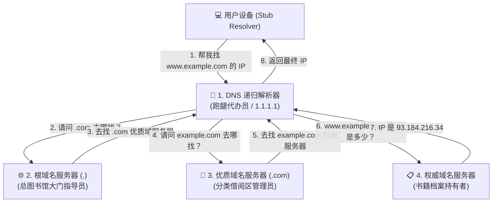

当你在浏览器敲下回车键后的短短几毫秒里，系统其实已经在幕后完成了一场跨越全球的接力寻址。所谓 **DNS 解析**，就是本地缓存、递归解析器、根服务器以及权威 DNS 之间分工协作，把域名一步步还原为实际 IP 的完整查询过程。

但你是否好奇过：当你在浏览器地址栏输入 `https://www.example.com` 并敲下回车键的那短短几毫秒里，你的电脑究竟经历了怎样的寻址探险？这本庞大的电话簿是如何在遍布全球的数百万台服务器之间接力配合，准确找到目标 IP 的？

这个在幕后完成的“打听与查找”全过程，就叫做 **DNS 解析（DNS Resolution / DNS Lookup）**。

今天就来带你化身一枚数据包，沉浸式体验一次完整的 DNS 解析之旅。

---

## 基本概念：什么是 DNS 解析与四大核心角色？

### 1. 什么是 DNS 解析？
**DNS 解析**是指客户端（例如你的手机或电脑）向 DNS 系统发起域名查询，经过一系列层级服务器的交互与检索，最终成功获取该域名对应 IP 地址的完整流程。

如果把查找 IP 的过程比作去图书馆寻找一本珍贵的绝版书，整个系统主要由以下 **四大核心角色** 共同协作完成：



### 2. 解析系统中的四大关键服务器
1. **DNS 递归解析器（DNS Recurser / Recursive Resolver）**
   - **比喻**：你的**“专属跑腿代办员”**。
   - **作用**：普通用户的电脑通常不具备直接向全球层级服务器逐一询问的能力。递归解析器接收到你发出的请求后，会替你奔走在全球各大服务器之间，直到把最终的 IP 地址查出来交给你。常见的公共递归解析器包括 Cloudflare 的 `1.1.1.1`、Google 的 `8.8.8.8` 和阿里 DNS `223.5.5.5`。
2. **根域名服务器（Root Nameserver）**
   - **比喻**：图书馆**“大厅总索引台”**。
   - **作用**：它是 DNS 分层体系的最顶端（`.` 根域）。全球有 13 组根服务器逻辑地址。它并不知道具体网站的 IP，但它清楚知道 `.com`、`.net`、`.cn` 等所有优质域名服务器应该去哪里找。
3. **优质域名服务器（TLD Nameserver）**
   - **比喻**：图书馆的**“分类书库管理员”**（如 `.com` 专区管理员）。
   - **作用**：负责管理特定优质后缀下的所有域名索引。当收到查询请求时，它会指引递归解析器前往该域名的“权威服务器”。
4. **权威域名服务器（Authoritative Nameserver）**
   - **比喻**：书本**“原版档案的唯一保管人”**。
   - **作用**：这是域名所有者（例如网站管理员）在 Cloudflare、阿里云或腾讯云控制台亲自配置 A 记录、CNAME 记录的终点站。它给出的答案就是权威的最终答案。

关于 DNS 基础设施的权威技术规范，也可以查阅 [Cloudflare DNS 解析指南与知识库](https://developers.cloudflare.com/dns/)。

---

## 进一步理解：一次完整 DNS 解析的 8 个步骤

为了彻底搞懂 DNS 是如何跑通的，我们以访问 `www.example.com` 为例，拆解其背后的标准解析步骤：

### 步骤 1：本地多层缓存排查
当你在浏览器输入网址后，设备并不会马上联网打听，而是先在本地“翻翻口袋”：
1. **浏览器自身缓存**：Chrome / Edge 等浏览器会缓存最近访问过的域名 IP。
2. **操作系统缓存（OS DNS Cache）**：如果浏览器没有，会询问系统的 DNS 缓存服务。
3. **本地 Hosts 文件**：检查本地计算机的 `hosts` 文件是否有手动绑定的静态 IP。
4. **家庭路由器缓存**：请求发送到路由器，路由器本地如果存有缓存则直接返回。

如果以上本地各层都没有命中，真正的网络解析之旅正式启程。

### 步骤 2：向递归解析器发起求助
你的设备将请求发送给网络配置中指定的 **递归解析器**（比如家庭宽带运营商 DNS 或你配置的 `1.1.1.1`）。

### 步骤 3：递归解析器询问根服务器
递归解析器检查自身缓存无果后，向全球 **根域名服务器（Root Nameserver）** 发出询问：“请问 `www.example.com` 的 IP 是什么？”

### 步骤 4：根服务器指引 TLD
根服务器回答：“我不知道具体 IP，但这是 `.com` 优质域名服务器的地址，你去找它吧！”

### 步骤 5：询问优质域名服务器（TLD）
递归解析器来到 **`.com` 优质域名服务器** 处询问：“请问 `www.example.com` 在哪里？”

### 步骤 6：TLD 服务器指引权威服务器
`.com` 优质服务器回答：“这是负责 `example.com` 的权威域名服务器（例如 `ns1.exampledns.com`）地址，具体记录在它手里！”

### 步骤 7：向权威域名服务器索取最终 IP
递归解析器向 **权威域名服务器** 发出终极询问。权威服务器查询自身的数据库记录，找到 `www.example.com` 对应的 A 记录，返回：“它的 IPv4 地址是 `93.184.216.34`，TTL 生存时间是 300 秒。”

### 步骤 8：返回结果并多级缓存
递归解析器拿到 IP 地址后：
- 将该记录保存在自己的缓存中（根据 TTL 时间保存 300 秒）；
- 将 IP 地址返回给你的操作系统；
- 操作系统存入系统缓存，并交给浏览器；
- 浏览器拿到 IP，正式向 `93.184.216.34` 的 443 端口发起 TCP 握手与 TLS 加密连接，网页迅速呈现在你眼前。

---

## 递归查询 vs 迭代查询：两者的区别是什么？

在学习 DNS 解析时，经常会遇到 **递归查询（Recursive Query）** 与 **迭代查询（Iterative Query）** 两个术语：

| 对比维度 | 递归查询 (Recursive Query) | 迭代查询 (Iterative Query) |
| :--- | :--- | :--- |
| **查询模式** | “请帮我彻底查出来，把最终答案给我！” | “我只告诉你下一步该找谁，你自己去打听。” |
| **客户端角色** | 处于被动等待状态，甩手掌柜 | 处于主动跟踪状态，自己拿着线索继续问 |
| **典型发生场景** | **用户电脑 $\rightarrow$ 递归解析器** 之间 | **递归解析器 $\rightarrow$ 根/TLD/权威服务器** 之间 |
| **网络开销** | 客户端只需发送 1 次请求、接收 1 次响应 | 解析器需要多次往返交互通信 |

简而言之：你对你的 DNS 服务器提要求是“递归”的；而 DNS 服务器在公网上到处打听的过程是“迭代”的。

---

## 实际应用：解析优化与日常故障排查

掌握了 DNS 解析原理后，许多日常网络困扰和优化技巧就会变得一目了然：

### 1. 为什么第二次打开网页明显比第一次快？
第一次打开新网站时，由于经历了完整的 8 步网络穿梭（冷启动），解析可能需要几十毫秒；而第二次访问时，浏览器和本地操作系统直接从内存缓存中秒级读取 IP（热缓存），解析耗时几乎为 0 毫秒。

### 2. CDN 如何利用 DNS 解析实现智能就近加速？
大型网站（如视频网站、应用商店）在全球部署了成千上万台 CDN 边缘节点。
- 当北京联通用户解析该域名时，权威 DNS 服务器根据用户的来源 IP，返回北京联通机房的 CDN IP；
- 当广州电信用户解析同一域名时，权威 DNS 返回广州电信机房的 CDN IP。
这种基于 DNS 解析的智能分流调度，确保了每位用户都能以最短的物理路径访问服务器。

### 3. 本地实用排查命令：如何手动测试解析？
如果你怀疑某个网站打不开是因为 DNS 解析故障，可以在终端中使用系统自带的工具进行诊断：

```bash
## Windows / macOS / Linux 通用测试命令
nslookup www.google.com

## 指定特定的 DNS 服务器进行解析测试（例如使用 Cloudflare 1.1.1.1）
nslookup www.google.com 1.1.1.1
```

在 macOS / Linux 上，还可以使用更专业的 `dig` 工具查看详细的解析链路与 TTL：
```bash
dig www.example.com +trace
```

### 4. 如何刷新本地 DNS 缓存？
当网站更换了新服务器 IP，而你的电脑由于旧缓存依然尝试连接旧 IP 报错时，可以手动清空本地 DNS 缓存：
- **Windows**：在 PowerShell 或 CMD 中运行 `ipconfig /flushdns`
- **macOS**：在终端运行 `sudo dscacheutil -flushcache; sudo killall -HUP mDNSResponder`

---

## 常见误区：关于 DNS 解析的认知误区

### 误区一：“每一次网页上的每一次点击，都要向根服务器发起一次完整查询？”
**纠正**：**绝大多数请求根本不需要打扰根服务器**。
现代互联网的缓存命中率极高（通常在 95% 以上）。递归解析器本身就长期缓存了所有的根服务器和 TLD 服务器地址，日常绝大多数解析只需要在递归服务器内部直接读取缓存，或者仅需向权威服务器发送一次确认请求即可。

### 误区二：“DNS 解析完全是明文暴露的，这有什么风险吗？”
**纠正**：**传统 DNS 解析确实完全基于明文 UDP 53 端口传输！**
这意味着你在解析哪个网站，沿途的 Wi-Fi 路由器、小区宽带交换机和运营商设备都能看得一清二楚。黑客甚至可以利用明文漏洞伪造虚假解析响应（即 **DNS 劫持 / DNS 污染**）。
为了解决这一安全隐患，现代网络引入了加密解析协议：[DNS over HTTPS (DoH)](/blog/tools-28/) 和 [DNS over TLS (DoT)](/blog/tools-29/)。

### 误区三：“只要把 DNS 解析改成 1.1.1.1，国内所有网页都能秒开？”
**纠正**：**不一定**。
如果解析国内网站，使用海外的公共 DNS 有时可能会导致 CDN 智能调度误判，将你的请求调度到香港甚至美国的 CDN 节点，反而导致国内网页访问速度变慢。对于国内网络流量，通常搭配国内优质公共 DNS（如阿里 `223.5.5.5` 或腾讯 `119.29.29.29`）会有更精准的 CDN 加速表现。

---

## 总结

DNS 解析是连接人类直觉意图与底层数字通信的高速桥梁。通过“递归解析器 $\rightarrow$ 根域名服务器 $\rightarrow$ 优质域名服务器 $\rightarrow$ 权威域名服务器”的层级分工与精妙缓存设计，全球互联网得以在海量并发下保持毫秒级的极速寻址响应。

然而，传统的 DNS 解析是明文发送的，存在被窥探和篡改的风险。如何给 DNS 解析穿上一层坚不可摧的“加密铠甲”？

请继续阅读下一篇重磅内容：[什么是 DNS over HTTPS？](/blog/tools-28/)。


## 推荐参考资料

为了确保本站科普内容的严谨性与客观性，本文关于 DNS (域名系统) 的解析原理与加密规范参考了以下权威资料：

* [RFC 1034 / 1035: 域名系统概念与设施](https://datatracker.ietf.org/doc/html/rfc1034) - IETF 官方 DNS 协议规范
* [Cloudflare 学习中心：什么是 DNS？](https://www.cloudflare.com/zh-cn/learning/dns/what-is-dns/) - Cloudflare 官方科普指南
* [ICANN: 关于 DNS 的运作原理](https://www.icann.org/resources/pages/dns-2012-02-25-en) - 互联网名称与数字地址分配机构\n