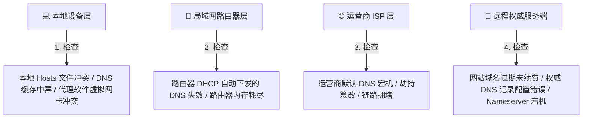

微信能正常收发消息，甚至游戏也能玩，但浏览器里的所有网页就是死活打不开——遇到这种现象，十有八九是 **DNS 解析** 出了问题。掌握几条简单的命令和排查步骤，几分钟内就能确认并解决绝大多数 DNS 故障。

> “微信、QQ 消息收发完全正常，甚至语音通话都很流畅，但浏览器里的所有网页就是死活打不开，一直显示‘找不到服务器’或者‘连接超时’！”

在计算机网络运维界，流传着一句广为人知的自嘲名言：
> *“It's not DNS. There's no way it's DNS. It was DNS.”*（绝不是 DNS 的锅，不可能跟 DNS 有关……查到最后发现，还真就是 DNS 出错了！）

为什么网络故障总能和 DNS 扯上关系？当我们遇到上网异常时，该如何快速、准确地判断这到底是不是 DNS 引起的问题？又该如何一步步排查并有效解决？

今天就来为你梳理出一套清晰实用的“网络医生诊断手册”。

---

## 基本概念：DNS 故障的典型症状与特征

### 1. 为什么“聊天软件正常，网页打不开”？
在前面的文章[《什么是 DNS？》](/blog/tools-26/)中我们讲过，浏览器访问网站必须依赖 DNS 将域名翻译为 IP 地址。
而微信、QQ 等即时通讯 App 在首次登录或运行期间，往往直接通过预置或已缓存的**纯数字 IP 地址列表**直接与服务器建立通信，完全绕过了本地系统的域名查询。

因此，当你发现：
- ✅ **即时通信软件正常在线、能收发文本**；
- ❌ **浏览器打不开任何以 `http://` 或 `https://` 开头的域名网址**；
这通常是判定 **DNS 发生故障** 的最典型特征。

### 2. 常见的浏览器 DNS 错误代码
当浏览器遭遇 DNS 解析失败时，页面通常会抛出明确的错误代码：

| 错误代码 / 提示信息 | 常见含义说明 |
| :--- | :--- |
| **`DNS_PROBE_FINISHED_NXDOMAIN`** | DNS 查询完成，但 DNS 服务器明确回复“该域名不存在”（NXDOMAIN = Non-Existent Domain） |
| **`DNS_PROBE_FINISHED_BAD_CONFIG`** | 本地设备的 DNS 服务器配置有误（例如填错了不存在的 DNS IP） |
| **`ERR_NAME_NOT_RESOLVED`** | 主机名无法解析，系统未能从指定的 DNS 服务器处获取到任何有效 IP |
| **`Server Not Found (找不到服务器)`** | 浏览器向本地 DNS 询问无果，无法建立底层通信连接 |

如果你想了解更多关于 DNS 报错与官方排查建议，可以参阅 [Cloudflare DNS 故障排除官方指南](https://developers.cloudflare.com/dns/)。

---

## 进一步理解：导致 DNS 出现问题的深层原因

DNS 是一个涉及本地客户端、路由器、宽带运营商和远程服务器的多层系统，故障通常可能发生在以下几个环节：



1. **本地系统 DNS 缓存污染**：网站更换了 IP，但你的电脑依然固执地使用过期的旧缓存进行连接。
2. **Hosts 文件存在陈旧映射**：以前手动修改过 `hosts` 文件绑定了某个测试 IP，后来该 IP 失效。
3. **运营商默认 DNS 瘫痪或劣化**：宽带运营商的本地递归 DNS 服务器突发拥堵、故障或被恶意拦截。
4. **代理客户端（如 [Clash](/blog/mac-clash-verge-rev-guide/) / sing-box）DNS 冲突**：开启了 TUN 虚拟网卡模式或 Fake-IP 模式，但在代理软件异常退出后，残留的系统 DNS 设置未能正常复原。
5. **网站源站权威解析故障**：目标网站自身的域名欠费、权威 DNS 服务商（如 Cloudflare / DNSPod）遭遇大规模网络波动。

---

## 实际应用：4 步极速排查与修复实战指南

当你怀疑自己的网络遇到了 DNS 问题时，请按照以下 4 个标准步骤进行定位和修复：

### 第一步：黄金验证法——IP 直连测试
这是检验网络是否是 DNS 问题的最核心手段。

1. 打开电脑的终端工具：
   - **Windows**：按下 `Win + R`，输入 `cmd` 或 `powershell` 并回车；
   - **macOS / Linux**：打开「终端（Terminal）」。
2. 执行以下测试命令：
   ```bash
## 测试 1：向纯 IP 发起 Ping 测试（测试基础网络物理通断）
   ping 223.5.5.5
   
## 测试 2：向域名发起 Ping 测试（测试域名解析）
   ping www.baidu.com
   ```
3. **诊断结论**：
   - 如果 **直接 Ping IP 通畅，但 Ping 域名提示“找不到主机”或直接超时**：可以 **100% 确诊为 DNS 解析故障**！
   - 如果连 Ping 纯 IP 也是“请求超时”或“网络不可达”：说明是你的路由器断网、网线松动或宽带整体欠费停机，属于基础网络物理故障，而非单纯的 DNS 问题。

---

### 第二步：刷新本地 DNS 缓存与重置网络
如果确诊为 DNS 解析问题，首先清除本地可能存在的脏缓存：

- **Windows 用户**：
  在 CMD / PowerShell 窗口中输入以下命令并回车：
  ```cmd
  ipconfig /flushdns
  ```
  *(看到“已成功刷新 DNS 解析缓存”即表示完成)*

- **macOS 用户**：
  在终端中输入以下命令并回车（需要输入管理员开机密码）：
  ```bash
  sudo dscacheutil -flushcache; sudo killall -HUP mDNSResponder
  ```

- **Chrome / Edge 浏览器内部缓存清理**：
  在浏览器地址栏输入 `chrome://net-internals/#dns`，点击 **「Clear host cache」** 按钮。

---

### 第三步：手动切换为可靠的公共 DNS 或开启 DoH
如果刷新缓存后依然无法上网，说明是你当前使用的上游 DNS 服务器（通常是运营商默认 DNS）出了故障。此时我们需要手动更换为优质的公共 DNS：

1. **进入网络适配器设置**：
   - **Windows**：进入「设置」 $\rightarrow$ 「网络和 Internet」 $\rightarrow$ 选择当前连接的 Wi-Fi 或以太网 $\rightarrow$ 编辑「DNS 服务器分配」为手动。
   - **macOS**：进入「系统设置」 $\rightarrow$ 「网络」 $\rightarrow$ 选择当前 Wi-Fi $\rightarrow$ 点击「详细信息」 $\rightarrow$ 在「DNS」标签页中添加。
2. **填入推荐的高可用公共 DNS**：
   - **首选 DNS**：`223.5.5.5`（阿里公共 DNS）或 `119.29.29.29`（腾讯 DNSPod）
   - **备用 DNS**：`1.1.1.1`（Cloudflare）或 `8.8.8.8`（Google）
3. **或直接开启加密 DNS**：
   参考我们之前的教程，在浏览器设置中开启 [DNS over HTTPS (DoH)](/blog/tools-28/) 或在安卓手机中开启 [DNS over TLS (DoT)](/blog/tools-29/)，既能避开运营商 DNS 故障，又能防范明文劫持。

---

### 第四步：检查 Hosts 文件与代理软件残留
如果更换了公共 DNS 后，大部分网站都能打开，但**唯独某一个特定网站死活打不开**：

1. **检查系统的 Hosts 文件**：
   - **Windows 路径**：`C:\Windows\System32\drivers\etc\hosts`
   - **macOS / Linux 路径**：`/etc/hosts`
   - 用文本编辑器打开该文件，检查末尾是否有针对该域名的硬编码 IP 绑定。如果有，将其整行删除并保存。
2. **检查代理客户端残留**：
   - 如果你之前使用过 Clash 等网络工具且出现过非正常崩溃，请重新打开该代理软件，彻底关闭其「TUN 虚拟网卡模式」或「系统代理」开关后再正常退出，确保操作系统的 DNS 接管被正确释放。

---

## 常见误区：排查 DNS 问题时的常见误区

### 误区一：“只要网页打不开，就肯定是路由器坏了或者光猫坏了？”
**纠正**：很多人遇到网页报错就急着拔路由器电源或给宽带客服打电话，但实际上 80% 以上的偶发性浏览故障仅仅是本地 DNS 缓存紊乱或运营商 DNS 短暂抽风。通过前面提到的 `ipconfig /flushdns` 刷新命令或切换公共 DNS，往往 30 秒内就能自行解决。

### 误区二：“把首选和备用 DNS 都设成 8.8.8.8，就一劳永逸了？”
**纠正**：在中国大陆日常网络环境下，将所有 DNS 都完全指向海外公共服务器（如 `8.8.8.8` 或 `1.1.1.1`），虽然解析境外网站很稳定，但可能会导致国内许多主流网站在 CDN [节点](/blog/what-is-node/)调度时产生偏差（比如将你调度至香港或日本机房），反而使得国内网站的打开速度变慢。最稳妥的策略是：**主 DNS 配置国内知名公共 DNS（如阿里 223.5.5.5），备用 DNS 配置国际公共 DNS**。

### 误区三：“Ping 域名不通，就代表目标网站一定关服跑路了？”
**纠正**：**不一定**。
许多现代大型网站（以及开启了防火墙防护的服务器）会在机房层面主动禁用 ICMP 回显响应（即“禁止 Ping”）。因此 Ping 域名无响应并不代表网站宕机，只要能在浏览器中通过 HTTPS 正常打开网页，就属于正常现象。

---

## 总结

DNS 故障虽看似神秘，但只要掌握了科学的诊断逻辑，排查起来非常清晰：

1. **先辨症状**：即时通讯在线但网页打不开，基本锁定为 DNS 故障；
2. **黄金验证**：Ping IP 正常但 Ping 域名失败，100% 为解析问题；
3. **对症下药**：清空本地缓存 $\rightarrow$ 更换优质公共 DNS / 启用 DoH $\rightarrow$ 排查 Hosts 与代理残留。

在网络故障排查中，除了 DNS 之外，还有一个与我们形影不离的核心排查工具——**Ping**。Ping 的底层原理是什么？延迟高、丢包率又是如何计算出来的？

请继续阅读下一篇网络基础知识指南：[《Ping 是什么？》](/blog/tools-31/)。


## 推荐参考资料

为了确保本站科普内容的严谨性与客观性，本文关于 DNS (域名系统) 的解析原理与加密规范参考了以下权威资料：

* [RFC 1034 / 1035: 域名系统概念与设施](https://datatracker.ietf.org/doc/html/rfc1034) - IETF 官方 DNS 协议规范
* [Cloudflare 学习中心：什么是 DNS？](https://www.cloudflare.com/zh-cn/learning/dns/what-is-dns/) - Cloudflare 官方科普指南
* [ICANN: 关于 DNS 的运作原理](https://www.icann.org/resources/pages/dns-2012-02-25-en) - 互联网名称与数字地址分配机构\n